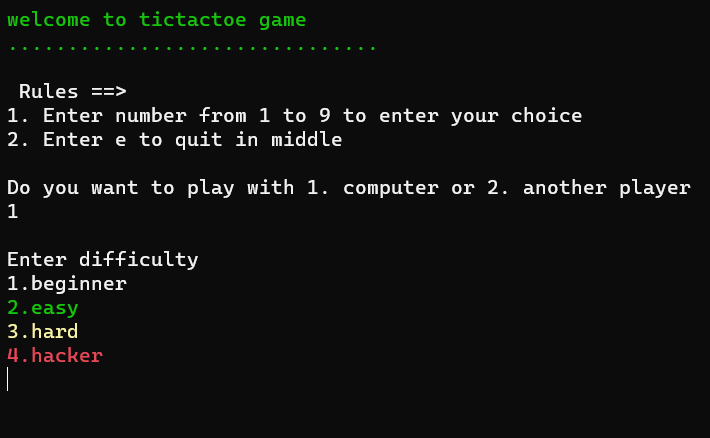

  
  
  
  

 

  

 

Welcome to my GitHub Page. I'm Nikhil, a Computer Science student. I love learning new things about programming and sharing my knowledge with others. I have over 2 years of experience in programming and have worked with various languages and technologies.

Here's a little about me:

- Languages: &nbsp; &nbsp; 
   &nbsp; &nbsp; 
   &nbsp; &nbsp; 
   &nbsp; &nbsp; 
  
- OS: &nbsp; &nbsp; 
   &nbsp; &nbsp; 
  

## Github Stats 📊

    
    

## 🌟 Projects

Here are some projects:

1. **A simple UCI chess Engine**
   
   Repository: [nikhiljangra264/chess_cpp](https://github.com/nikhiljangra264/chess_cpp)

2. **A console-based TicTacToe game with two modes: play with another player or AI**
   
   Repository: [nikhiljangra264/tictactoe](https://github.com/nikhiljangra264/tictactoe)

3. **A small repo containing header files**
   Repository: [nikhiljangra264/header_files](https://github.com/nikhiljangra264/header_files)

Feel free to explore my repositories for more!

Thank you for visiting my GitHub profile. Let's connect and learn together! 🚀

<!---
NikhilWalker/NikhilWalker is a ✨ special ✨ repository because its `README.md` (this file) appears on your GitHub profile.
You can click the Preview link to take a look at your changes.
--->
