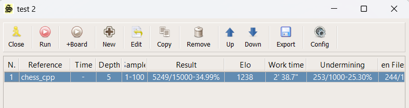
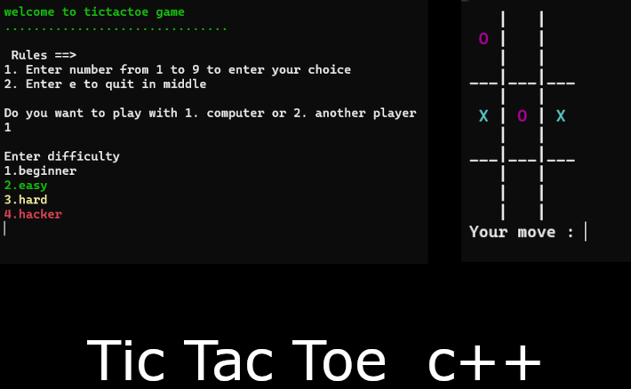

	
  	
  	
  	

 

  	

 

Welcome to my GitHub Page. I'm Nikhil, a Computer Science student. I love learning new things about programming. I have over 2 years of experience in programming and have worked with various languages and technologies.

> Tools and technologies that I have worked with and am interested in

<table style="width: 100%;">
	<tr>
	    <td align="center">
	         
	        C++
	    </td>
		<td align="center">
	         
	        C
	    </td>
		<td align="center">
        	 
        	cmake
    	</td>
	</tr>
	<tr>
    	<td align="center">
      		 
        	Python
    	</td>
	    <td align="center">
	         
	        GitHub
	    </td>
	    <td align="center">
	         
	        Git
	    </td>
  	</tr>
	<tr>
	    <td align="center">
        	 
        	Linux
    	</td>
		<td align="center">
        	 
        	windows
    	</td>
		<td align="center">
        	 
        	visual studio
    	</td>
  	</tr>
</table>

## Github Stats 📊

    
    

## 🌟 Projects

Here are some self projects:

1. **A Simple UCI Chess Engine**

   Repository: [nikhiljangra264/chess_cpp](https://github.com/nikhiljangra264/chess_cpp)

   

2. **A Console-Based TicTacToe Game**

	Repository: [nikhiljangra264/tictactoe](https://github.com/nikhiljangra264/tictactoe)
   
   

3. **Header Files Repository**

   Repository: [nikhiljangra264/header_files](https://github.com/nikhiljangra264/header_files)

Feel free to explore my repositories for more!

Thank you for visiting my GitHub profile. Let's connect and learn together! 🚀

<!---
NikhilWalker/NikhilWalker is a ✨ special ✨ repository because its `README.md` (this file) appears on your GitHub profile.
You can click the Preview link to take a look at your changes.
--->
