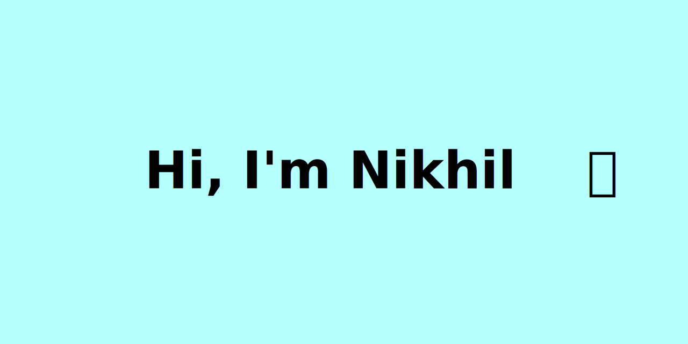
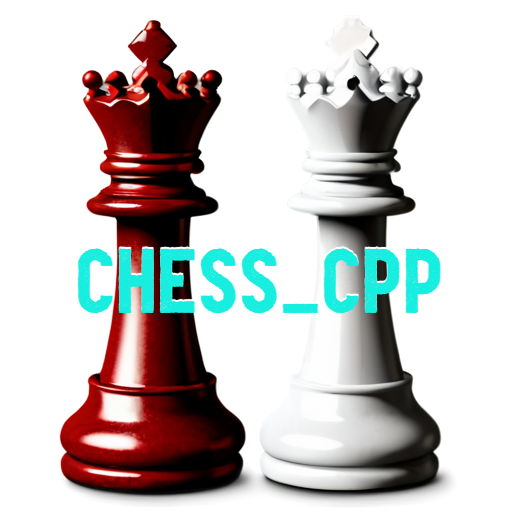
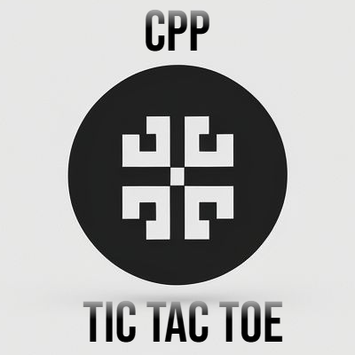

	
  	
  	
	

 

  	

 

Welcome to my GitHub Page. I'm Nikhil, a Computer Science student. I love learning new things about programming. I have over 2 years of experience in programming and have worked with various languages and technologies.

> Tools and technologies that I have worked with and am interested in:

<table style="width: 100%;">
	<tr>
	    <td align="center">
	         
	        C++
	    </td>
		<td align="center">
	         
	        C
	    </td>
		<td align="center">
        	 
        	CMake
    	</td>
	</tr>
	<tr>
    	<td align="center">
      		 
        	Python
    	</td>
	    <td align="center">
	         
	        GitHub
	    </td>
	    <td align="center">
	         
	        Git
	    </td>
  	</tr>
	<tr>
	    <td align="center">
        	 
        	Linux
    	</td>
		<td align="center">
        	 
        	Windows
    	</td>
		<td align="center">
        	 
        	Visual Studio
    	</td>
  	</tr>
</table>

## GitHub Stats 📊

    
    

## 🌟 Projects

Here are some self projects:

1. **Chess_cpp**

	UCI based Chess Engine

   Repository: [nikhiljangra264/chess_cpp](https://github.com/nikhiljangra264/chess_cpp)

   

2. **A Console-Based TicTacToe Game**

	Repository: [nikhiljangra264/tictactoe](https://github.com/nikhiljangra264/tictactoe)
   
   	

3. **A GUI based TicTacToe Game**

   	Repository: [nikhiljangra264/Tic-Tac-Toe](https://github.com/nikhiljangra264/Tic-Tac-Toe)

	

4. **Header Files**

	contain data structures implementation

	Repository: [nikhiljangra264/header_files](https://github.com/nikhiljangra264/header_files)

Feel free to explore my repositories for more!

Thank you for visiting my GitHub profile. Let's connect and learn together! 🚀